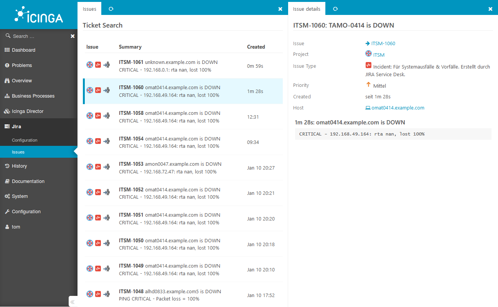

# Icinga Web Jira Integration

Hassle-free deep integration with Atlassian Jira. Depending on your needs, this
module is able to:

* create **Jira Issues for Problems** detected by Icinga
* create **only one** issue per problem
* **acknowledge** Icinga Problems once a Jira issue has been created
* manually create Host- or Service-related Jira issues
* shows a Host/Service-related **Jira Issue History**

And there is more. Use custom templates to trigger Jira **Workflows** according
your very own needs. This way you can automatically fill Jira custom fields
based on monitored system properties. This feature is mostly being used to
assign monitored objects to their **related CIs** or to trigger dedicated
**customer-related workflows**.

Let's [get started](doc/01-Introduction.md)!

