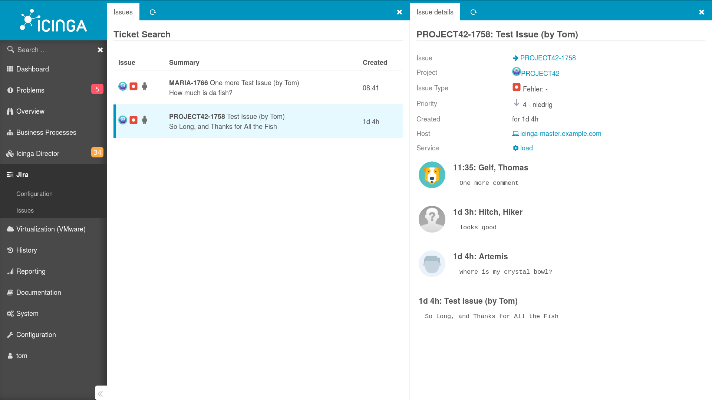

Icinga Module for JIRA
======================

Hassle-free deep integration with Atlassian Jira. This module:

* creates **JIRA Issues for Problems** detected by Icinga
* makes sure to create **only one** issue per problem
* **acknowledges** Icinga Problems once a JIRA issue has been created
* optionally provides a quick way to manually create Host- or Service-related
  JIRA issues
* shows Host/Service-related JIRA **Issue History**

This is 100% free Open Source Software. Interested? Then let's [get started](doc/01-Introduction.md)!

