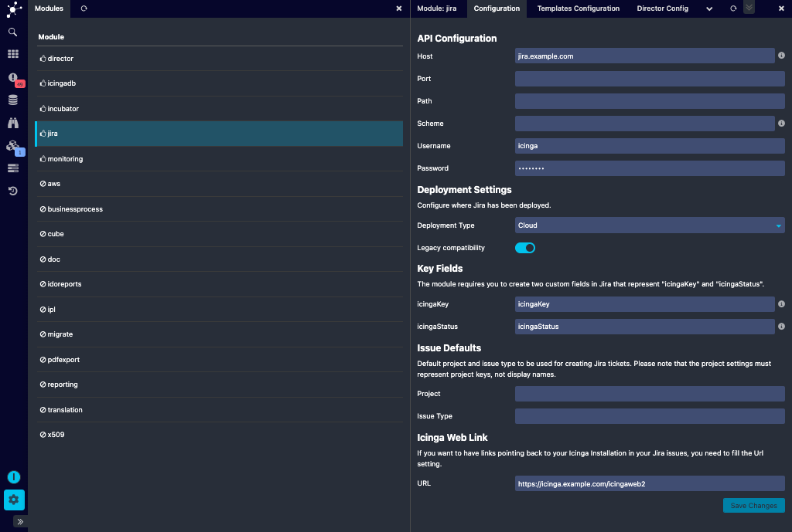
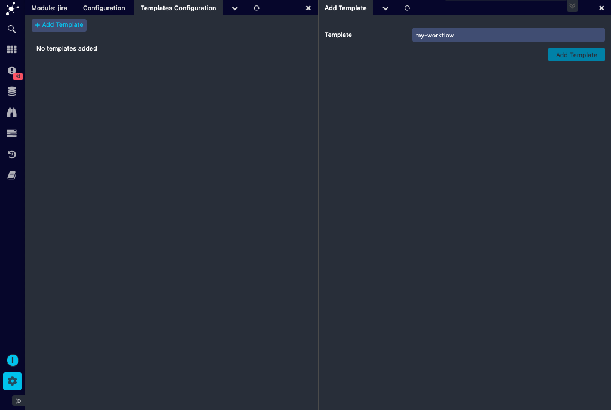
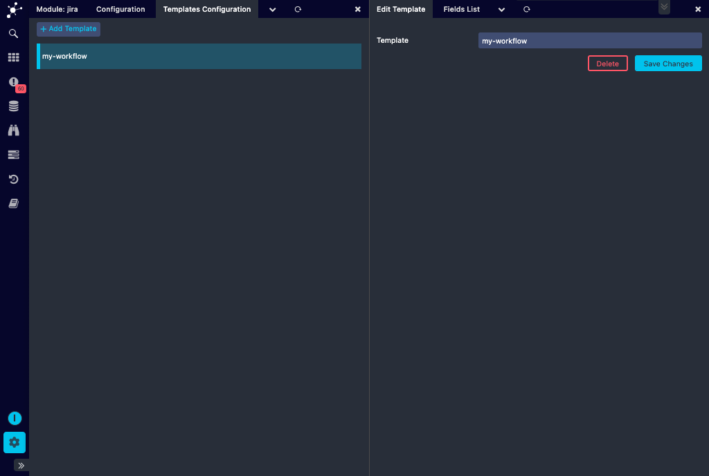
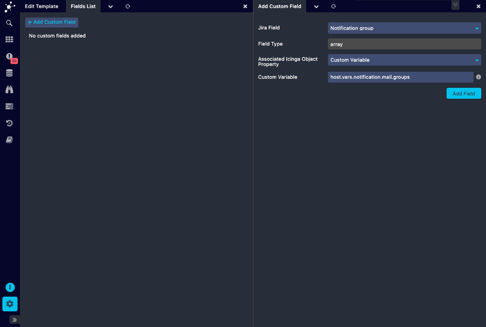
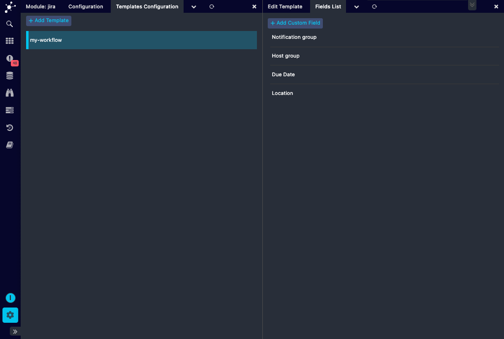

# Configuration

## Configuring in Web GUI

Jira allows you to configure the settings in Web GUI. Once the `jira` module has been enabled, go to its `Configuration`
tab and configure the settings for the module as shown in the screenshot.



## Manual Configuration

To manually create a related configuration file, please create a dedicated module configuration directory, like:

    install -d -m 2770 -o www-data -g icingaweb2 /etc/icingaweb2/modules/jira

Please adjust owner and group to fit your system, and also the directory in case
your `ICINGAWEB_CONFIGDIR` is not `/etc/icingaweb2`.

We need a new file named `config.ini` in this newly created directory:

```ini
[api]
host = "jira.example.com"
; port = 443
; path = "/"
; scheme = "https"
username = "icinga"
password = "password"

[ui]
; default_project = "SO"
; default_issuetype = "Event"

[key_fields]
; icingaStatus = "icingaStatus"
; icingaKey = "icingaKey"

[icingaweb]
url = "https://icinga.example.com/icingaweb2"
```

The `port` and `path` settings are optional, protocol is always HTTPS. The
given user needs permissions to create (and show) issues in at least one Jira
project.

If you want to have links pointing back to your Icinga Installation in your
Jira issues, you need to fill the `url` setting.

The `ui` section allows to optionally pre-select a specific project and/or a
specific issue type in the "Create New Issue" form. Please note that those
values must represent "real" names, not display names. In the above example
the project named "Service Operations" had the shortcut "SO".

If you want to run `icingacli` commands (read: send notifications), then your
Icinga user must be member of the `icingaweb2` group. In case it isn't, this
can usually be fixed as follows:

    usermod -a -G icingaweb2 icinga2

Depending on your OS configuration, it might be required to restart Icinga 2
afterwards:

    systemctl restart icinga2.service

## Required Jira Custom Fields

This module requires you to create two custom fields in Jira:

* `icingaKey`: a searchable text field
* `icingaStatus`: a short text field, 12 characters are enough

## icingaKey field value

TL;DR: you do not need to read this, it is just for those who are curios how
this field is going to be used.

This module uses `icingaKey` to figure out whether an issue for the given object
already exists. Hosts use their host name, services use hostname!servicename.
As Jira seems to offer no exact search for custom text fields out of the box (at
least not without installing extra plugins), we are cheating. Search is down via
`~` and we add surrounding escaped double quotes. Still, this doesn't seem to be
enough. So we prefix the key with `BEGIN` and postfix it with `END`.

Said all this, the `icingaKey` for `Disk Space` on `example.com` will result in the
following JQL construct:

    icingaKey ~ "\"BEGINexample.com!Disk SpaceEND\""

A little bit weird, but it should work fine. And as this field is usually not
shown anywhere, it shouldn't disturb.

## Fill Jira Custom Fields

For your customized workflows you might need this module to ship additional
fields. Additional Jira custom fields for the issues can either be configured in Web GUI or manually:

1. **Web GUI** :
   * Once the Jira module has been enabled and its settings are configured, visit the `Templates Configuration` 
page to create a new template.

   

   * Click on the template to which the additional fields need to be added.
 
   

   * Add the required additional fields to the template as shown in the screenshot below. These
   fields can be associated with host groups, service groups or a custom variable. They could also be some other
   values relevant to the issue being created. Currently only fields of type string, array, number and date are 
   supported in Web GUI. Multi-select array type and other type custom fields are not supported.

   

   * The fields added to a template will be listed in the `Fields List` tab of that corresponding template.

   

2. **Manually** : Create corresponding templates in your `templates.ini` in 
`<ICINGAWEB_CONFIGDIR>/modules/jira/templates.ini`. This template can then be used while creating the issue.

> **Hint**: This is optional, do not blindly copy & paste. Use this as an
> example in case you need to feed different workflows with special paprameters.

```ini
[my-workflow]
Task = "API"
SearchCategory = "CI"
SearchTerm = "${host}.example.com"
Activity.value = "proactive"
customfield_1232 = "Icinga"
duedate = "3 days"
```

Pass `my-workflow` to your NotificationCommand through the `--template` parameter
and your issue will fill in and pass all above fields.

* It is possible to use the internal field name (like `customfield_1232`), but
  the visible name is also fine. Even special characters like in `Aktivität` are
  allowed

* In case your Custom Field expects an Array of values, please use numeric keys
  as in this example:

```ini
[my-workflow]
; ...
Teams.0.value = "My Team"
Teams.1.value = "Another Team"
Tags.0 = "ama"
Tags.1 = "zing"
```

* You can use placeholders for variables via `${varname}`. You can use some of
  the predefined ones, but you can also add new ones. You can for example use
  `${location}` and pass `$host.vars.location$` via `--location`, just make sure
  that the parameter name matches the placeholder/variable name

* Predefined variable names are host, service, state, project, issuetype, summary
  and description

That's it, now you should be ready to start [Sending Notifications](10-Notifications.md).
