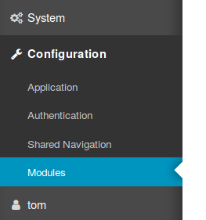
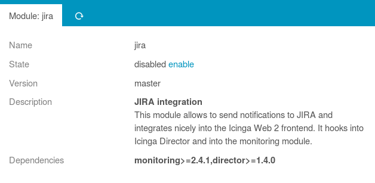

Installation and Configuration
==============================

Dependencies
------------

* Icinga Web 2 (&gt;= 2.4.1)
* Icinga Director (&gt;= v1.5.0)
* PHP (&gt;= 5.4 or 7.x)

The Icinga Web 2 `monitoring` module should be configured and enabled.

Even if not using [Icinga Director](https://github.com/Icinga/icingaweb2-module-director),
it must at least be installed and enabled in your [Icinga Web 2](https://github.com/Icinga/icingaweb2).
This module borrows some libraries from the Director.

Installation from .tar.gz
-------------------------

Download the latest version and extract it to a folder named `jira`
in one of your Icinga Web 2 module path directories.

You might want to use a script as follows for this task:
```sh
ICINGAWEB_MODULEPATH="/usr/share/icingaweb2/modules"
REPO_URL="https://github.com/Icinga/icingaweb2-module-jira"
TARGET_DIR="${ICINGAWEB_MODULEPATH}/jira"
MODULE_VERSION="1.0.0"
URL="${REPO_URL}/archive/v${MODULE_VERSION}.tar.gz"
install -d -m 0755 "${TARGET_DIR}"
wget -q -O - "$URL" | tar xfz - -C "${TARGET_DIR}" --strip-components 1
```

Installation from GIT repository
--------------------------------

Another convenient method is the installation directly from our GIT repository.
Just clone the repository to one of your Icinga Web 2 module path directories.
It will be immediately ready for use:

```sh
ICINGAWEB_MODULEPATH="/usr/share/icingaweb2/modules"
REPO_URL="https://github.com/Icinga/icingaweb2-module-jira"
TARGET_DIR="${ICINGAWEB_MODULEPATH}/jira"
MODULE_VERSION="1.0.0"
git clone "${REPO_URL}" "${TARGET_DIR}"
git checkout "v${MODULE_VERSION}"
```

You can now directly use our current GIT master or check out a specific version.

Enable the newly installed module
---------------------------------

Enable the `jira` module either on the CLI by running

```sh
icingacli module enable jira
```

Or go to your Icinga Web 2 frontend, choose `Configuration` -&gt; `Modules`...



select the `jira` module and `enable` it:




Configuration
-------------

Currently you have to manually create a related configuration file. In future
we'd love to allow you to provide these settings directly in the Web GUI. For now
please create a dedicated module configuration directory, like:

    install -d -m 2770 -o www-data -g icingaweb2 /etc/icingaweb2/modules/jira

Please adjust owner and group to fit your system, and also the directory in case
your `ICINGAWEB_CONFIGDIR` is not `/etc/icingaweb2`.

We need a new file named `config.ini` in this newly created directory:

```ini
[api]
host = "jira.example.com"
; port = 443
; path = "/"
username = "icinga"
password = "***"
```

The `port` and `path` settings are optional, protocol is always HTTPS. The
given user needs permissions to create (and show) issues in at least one JIRA
project.

If you want to run `icingacli` commands (read: send notifications), then your
Icinga user must be member of the `icingaweb2` group. In case it isn't, this
can usually be fixed as follows:

    usermod -a -G icingaweb2 icinga2

Depending on your OS configuration, it might be required to restart Icinga 2
afterwards:

    systemctl restart icinga2.service

Required JIRA Custom Fields
---------------------------

This module requires you to create two custom fields in JIRA:

* `icingaKey`: a searchable text field
* `icingaStatus`: a short text field, 12 characters are enough

### icingaKey field value

TL;DR: you do not need to read this, it is just for those who are curios how
this field is going to be used.

This module uses `icingaKey` to figure out whether an issue for the given object
already exists. Hosts use their host name, services use hostname!servicename.
As JIRA seems to offer no exact search for custom text fields out of the box (at
least not without installing extra plugins), we are cheating. Search is down via
`~` and we add surrounding escaped double quotes. Still, this doesn't seem to be
enough. So we prefix the key with `BEGIN` and postfix it with `END`.

Said all this, the `icingaKey` for `Disk Space` on `example.com` will result in the
following JQL construct:

    icingaKey ~ "\"BEGINexample.com!Disk SpaceEND\""

A little bit weird, but it should work fine. And as this field is usually not
shown anywhere, it shouldn't disturb.

Fill JIRA Custom Fields
-----------------------

For your customized workflows you might need this module to ship additional
fields. This is as easy as creating corresponding templates in your `templates.ini`
in `<ICINGAWEB_CONFIGDIR>/modules/jira/templates.ini`:

```ini
[my-workflow]
Task = "API"
SearchCategory = "CI"
SearchTerm = "${host}.example.com"
Activity.value = "proactive"
customfield_1232 = "Icinga"
```

Pass `my-workflow` to your NotificationCommand through the `--template` parameter
and your issue will fill in and pass all above fields.

* It is possible to use the internal field name (like `customfield_1232`), but
  the visible name is also fine. Even special characters like in `Aktivität` are
  allowed

* You can use placeholders for variables via `${varname}`. You can use some of
  the predefined ones, but you can also add new ones. You can for example use
  `${location}` and pass `$host.vars.location$` via `--location`, just make sure
  that the parameter name matches the placeholder/variable name

* Predefined variable names are host, service, state, project, issuetype, summary
  and description

That's it, now you should be ready to start [Sending Notifications](10-Notifications.md).
