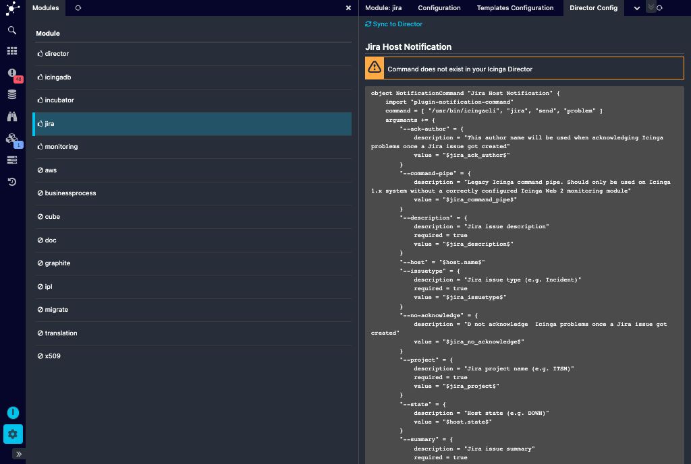

Icinga Director Integration
===========================

You do not need to manually create a `NotificationCommand` definition. This
module integrates nicely with the [Icinga Director](https://github.com/Icinga/icingaweb2-module-director)
and allows you to generate definitions for hosts and services with a single
click.

Please note that this option will not be shown unless you have `director/admin`
permissions. This is how it looks like on a fresh installation:

Now, please click the `Sync to Director` action link:

You should be notified about the succesful operation, and the sync state will
get green:

And don't worry, you can click the `Sync` action as many times as you want,
nothing bad will happen. In case you modified your definition in the Director,
this will be recognized - and a single click will allow you to restore the
defaults. Of course only in case this is what you want to happen.

A single click on the object name brings you directly to the related Command
definition in your Director module.
