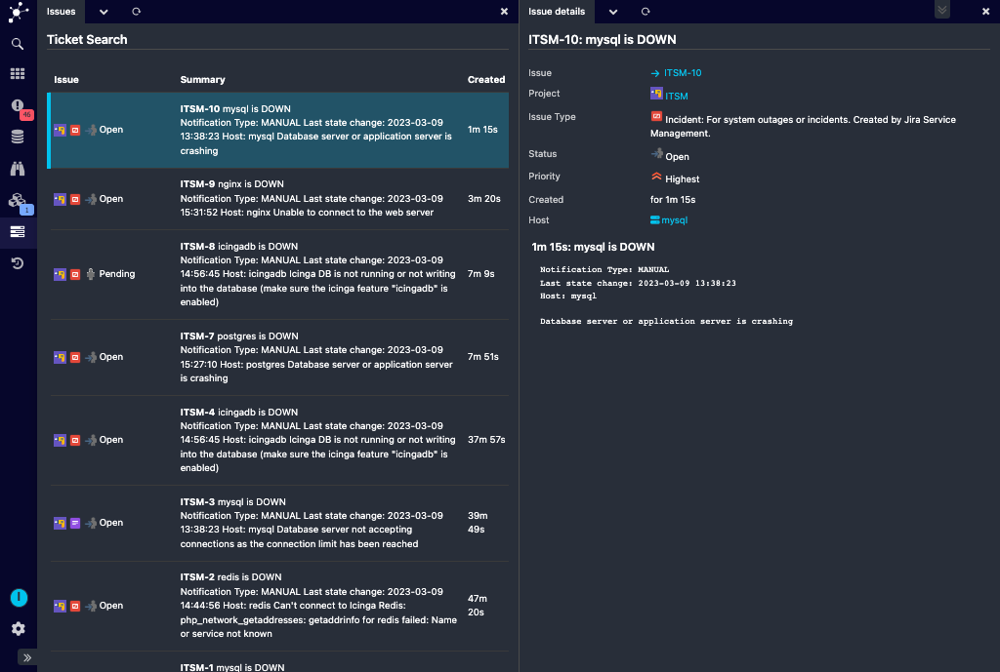

Issue History and Details
=========================

For convenience, this module comes with a nice overview of your created Jira
issues. It shows your most recent issues, combined with the most important
details. Please note that only issues created by the configured Jira user will
be shown.

Issue History Table
-------------------

This table shows three icons in the first column, the related project, issue
type and current state. Please move the mouse over those icons to get more
details. 

The Summary column shows issue summary and description, and the last column
shows how long ago the issue has been created. Move the mouse over the shown
time to read the full related creation time with timezone details.

You can then choose an issue, and you'll provided with some more details. All
comments posted to this issue will be shown. Also, there are and some links
pointing to Jira (directly to the issue or to it's project) and to the related
Icinga Host or Service.

Monitoring / Icinga DB Web integration
----------------------

It is also possible to filter the issue list by host (and optionally servcie)
name. Not need to manually 

This module hooks into the `monitoring` or `icingadb` module and provides so-called Host and
Service Action Hooks. A single click brings you to your Host (or Service) issue
history.
